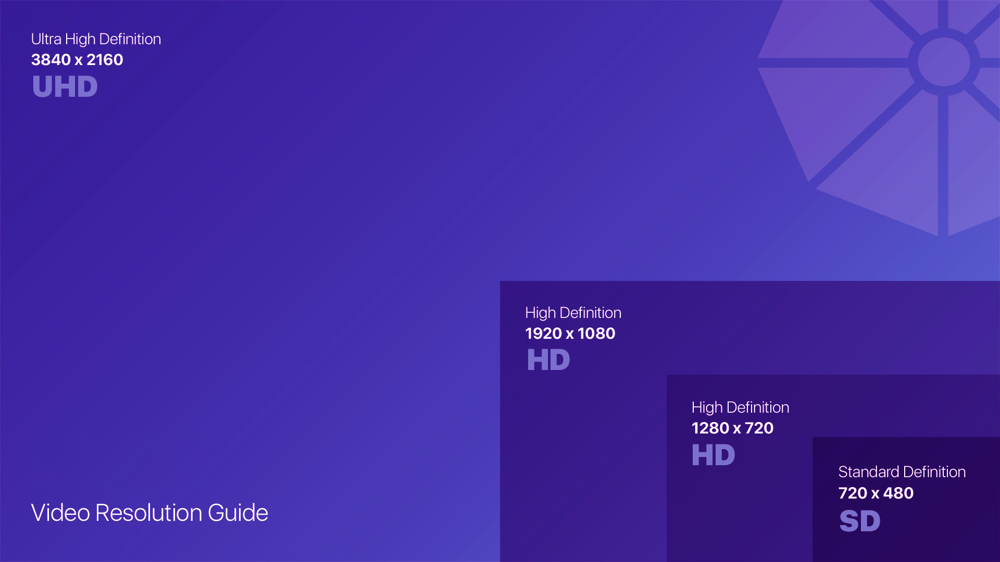
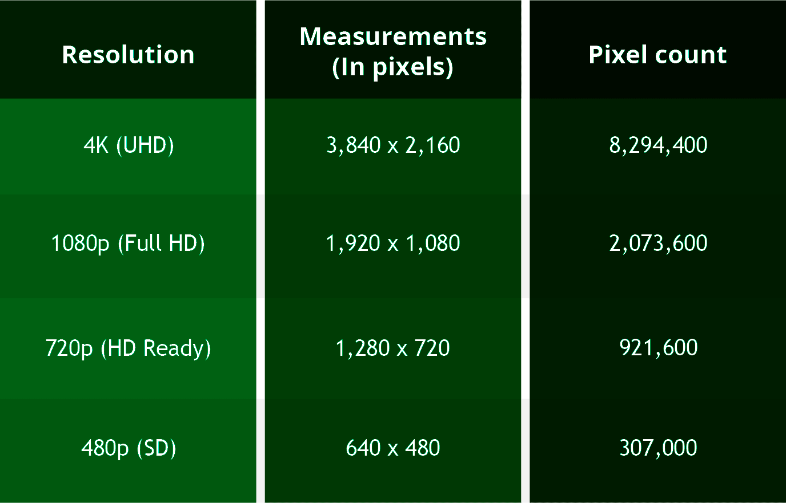
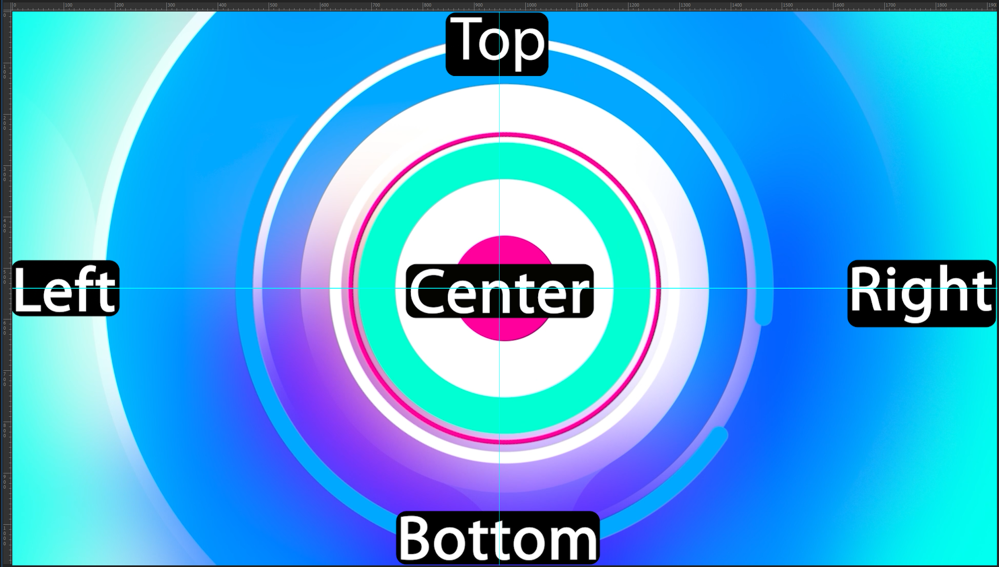
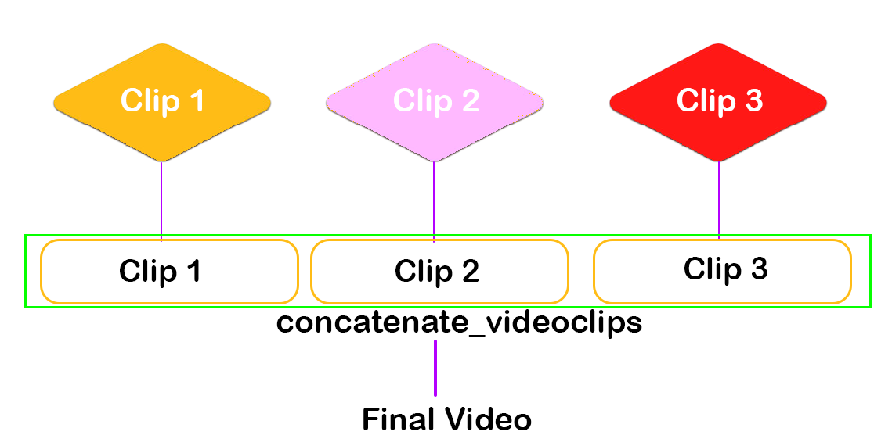
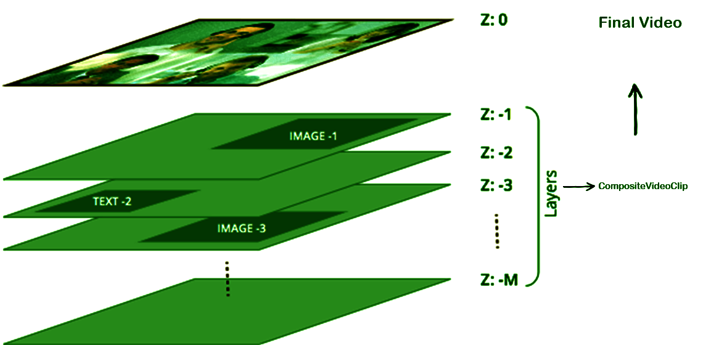

    [1687353036303](image/markdown/1687353036303.png)

    ***Python MoviePy with ChatGPT***

# Video 1

* MoviePy Introduction
* Live Project Example

  Video Link :[https://youtu.be/bIv1RjaxXnE](https://youtu.be/bIv1RjaxXnE "Video 1")

# Video 2

 **Project Index**

1. Video Cretion

   * Video Concatenation
   * Video resize
   * Subclip
   * Adding Clip Arts
   * Adding Text Clips
2. Audio Editing

   * Audio Concatenation
   * Audio db increasing
   * Audio exporting from video
   * Text to Audio converstion
3. Automation

   * ChatGPT (OpenAI) API Integration
   * Azure text-to-speech API integration
   * Youtube uploader

  Video link :[https://youtu.be/w7dBq8BlOTM](https://youtu.be/w7dBq8BlOTM "Video 2")

# VIdeo 3

* [X] Python Installation
* [X] ImageMagick Installation

| Image Magick environment variables | Value                                                  |
| ---------------------------------- | ------------------------------------------------------ |
| 1:                                 |                                                        |
| variable name:                     | IMAGEMAGICK_BINARY                                     |
| variable value:                    | C:\Program Files\ImageMagick-7.1.1-Q16-HDRI\magick.exe |
| 2:                                 |                                                        |
| variable name:                     | IMAGIO_FFMPEG_EXE                                      |
| variable value:                    | C:\Program Files\ImageMagick-7.1.1-Q16-HDRI\ffmpeg.exe |

* [X] VScode Installation
* [X] Python Environment Setup `py -m venv venv`
* [X] OpenAI API Creation

  | OpenAI environment variable | Value                    |
  | --------------------------- | ------------------------ |
  | variable name:              | OPENAI_API_KEY           |
  | variable value:             | copy from OpenAI website |
* [X] Moviepy Installation  `pip install moviepy`
* [X] Git initialization `git init`

  Video Link: [https://youtu.be/AXFfwMjZfR0](https://youtu.be/AXFfwMjZfR0 "Video 3")

# Video 4

Video Properties ( Basic knowledge about Dimensions )

Video Link: [https://youtu.be/wCkXnvDYLbA](https://youtu.be/wCkXnvDYLbA "Video 4")

# Video 5

* Rotating the Video
* Making Subclips from Video
* Removing Audio from Video

Codec formats:

* libx264 (H.264) (AVC)   	= Advanced Video Coding (AVC)
* libx265 (H.265) (HEVC)  	= High-Efficiency Video Coding (HEVC). More processing power for encoding and decoding.
* vp9	      	= Developed By Google. More computational resources for encoding and decoding.
* av1		= Alliance. More computational resources for encoding and decoding.
* mpeg2 		= Decent video quality but has lower compression efficiency compared to newer codecs like H.264 or VP9
* mpeg4 		= Good video quality

Video links : [https://youtu.be/gjHy5fi9MX8
](https://youtu.be/gjHy5fi9MX8 "Video 5")

# [V](https://youtu.be/gjHy5fi9MX8 "Video 5")ideo 6

MoviePy VideoFileClip Operations

* moviepy video
* moviepy video subclip
* moviepy video from images
* moviepy video duration
* moviepy video quality

  * moviepy video resize
  * moviepy videofileclip resize
* moviepy video to frames
* moviepy video to gif
* moviepy video concatenate_videoclips

  
* moviepy video CompositeVideoClip

  
* moviepy video to audio

Video Link : [https://youtu.be/kl2EoQPV144](https://youtu.be/kl2EoQPV144 "Video 6")

# Video 7

* Moviepy CompositeVideoClip

Video Link : [https://youtu.be/s7pTkK7lOFQ](https://youtu.be/s7pTkK7lOFQ "Video 7")

---

# Git Repositorie Links

HTTPS		:	[https://github.com/thotakuriravi/moviepy.git ](https://github.com/thotakuriravi/moviepy.git)

Git Clone		:       git clone [https://github.com/thotakuriravi/moviepy.git ](https://github.com/thotakuriravi/moviepy.git)folder_name

GitHub CLI	:	[gh repo clone thotakuriravi/moviepy]([gh repo clone thotakuriravi/moviepy]())

---

# **Youtube Videos Links**

MoviePy Playlist link : [https://www.youtube.com/playlist?list=PLXqeWPJynZfj5pOwjIvV-W4_s_t-ais7l](https://www.youtube.com/playlist?list=PLXqeWPJynZfj5pOwjIvV-W4_s_t-ais7l "MoviePy Playlist")

Video 1  : [https://youtu.be/bIv1RjaxXnE](https://youtu.be/bIv1RjaxXnE "Video 1")

Video 2  : [https://youtu.be/w7dBq8BlOTM](https://youtu.be/w7dBq8BlOTM "Video 2")

Video 3  : [https://youtu.be/AXFfwMjZfR0](https://youtu.be/AXFfwMjZfR0 "Video 3")

Video 4  : [https://youtu.be/wCkXnvDYLbA](https://youtu.be/wCkXnvDYLbA "Video 4")

Video 5  : [https://youtu.be/gjHy5fi9MX8](https://youtu.be/gjHy5fi9MX8 "Video 5")

Video 6  : [https://youtu.be/kl2EoQPV144](https://youtu.be/kl2EoQPV144 "Video 6")

Video 7  : [https://youtu.be/s7pTkK7lOFQ](https://youtu.be/s7pTkK7lOFQ "Video 7")
